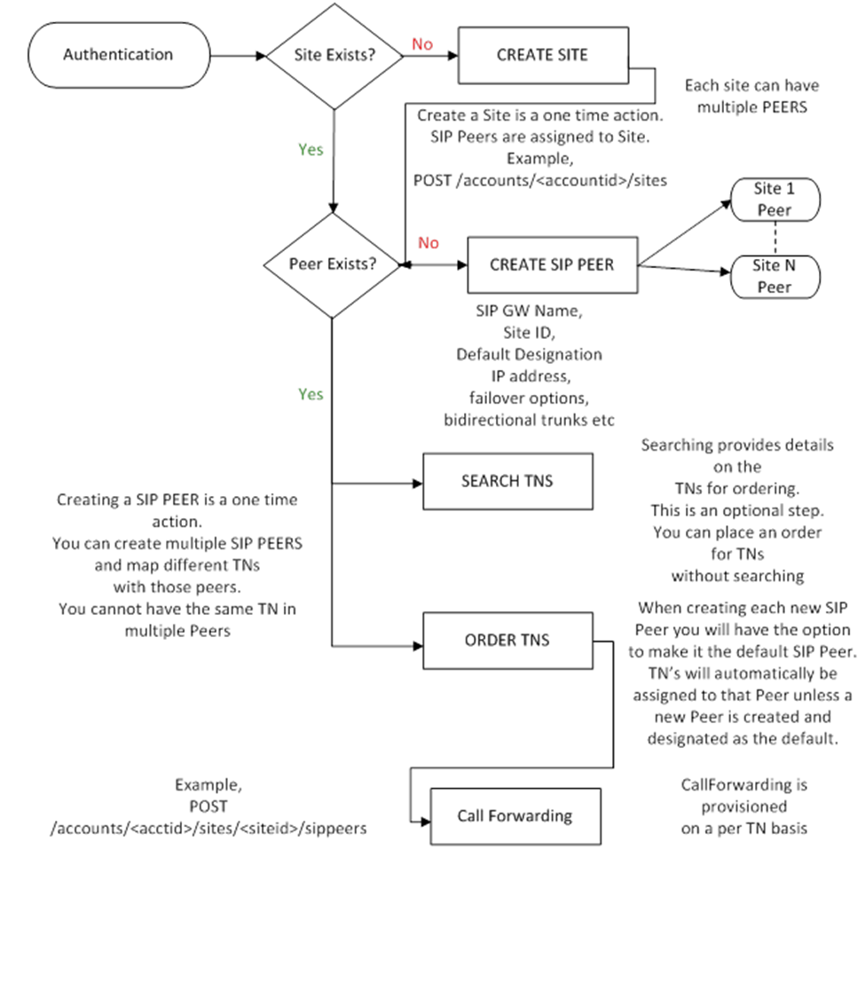

# Account Configuration Model

The basic work-flow for configuring an account, and subsequently managing numbers on that account is diagrammed below.  This involves first defining the logical and physical infrastructure, and subsequently adding and managing Telephone Numbers via ordering and Porting.

