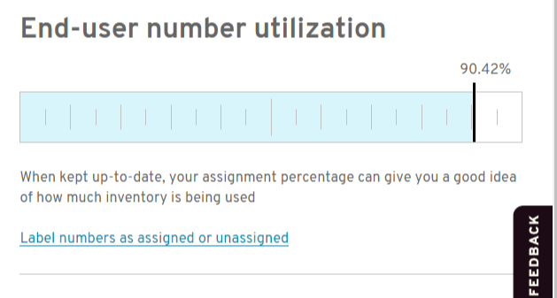
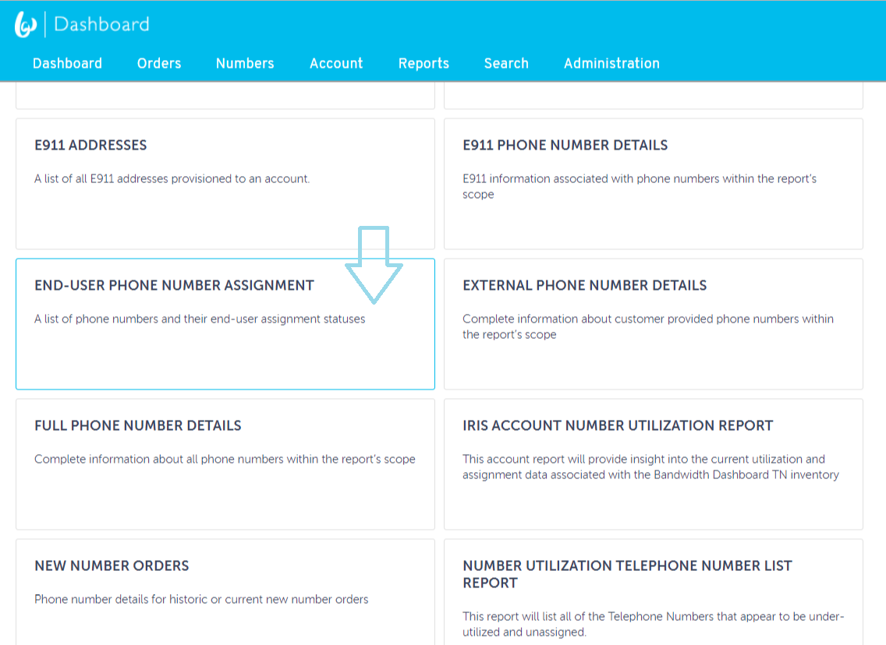
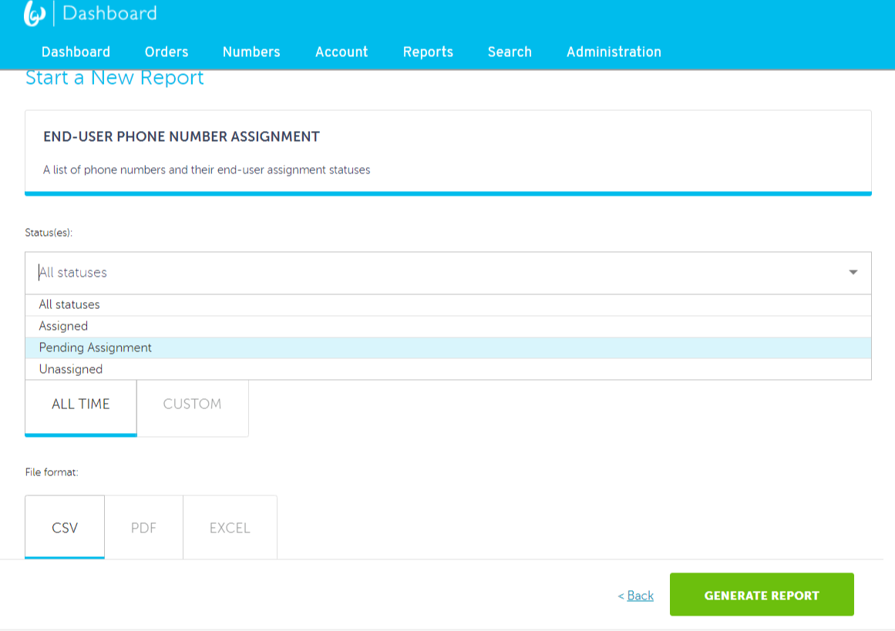
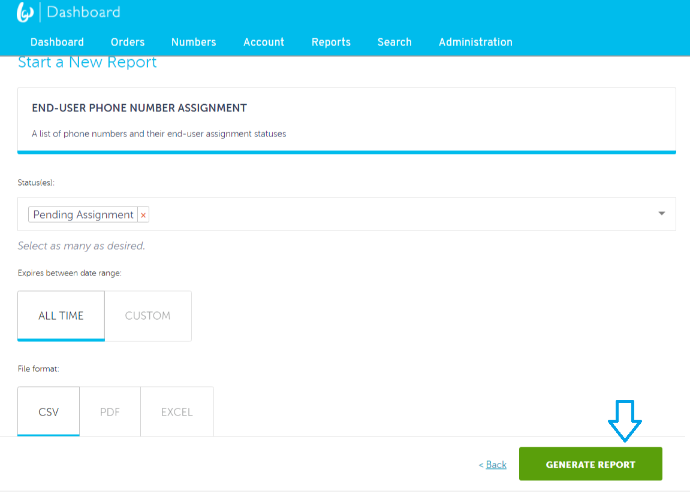
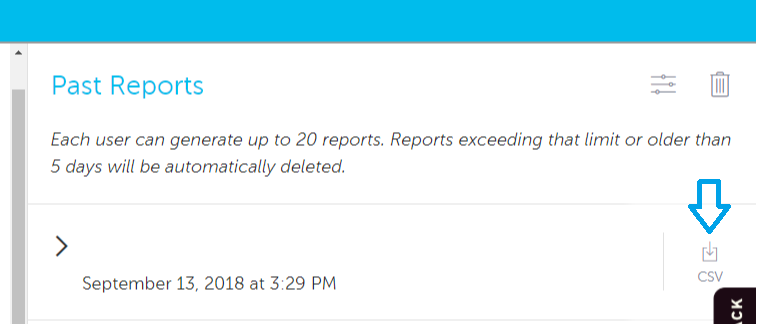
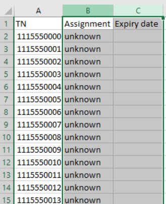
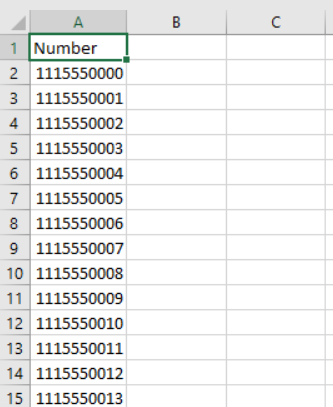
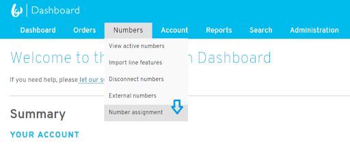
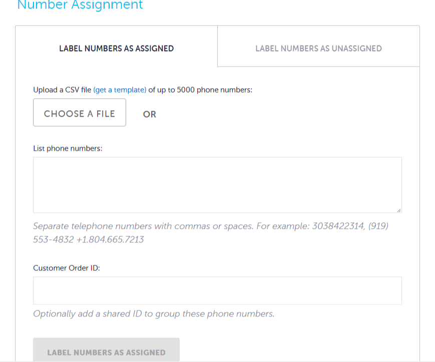
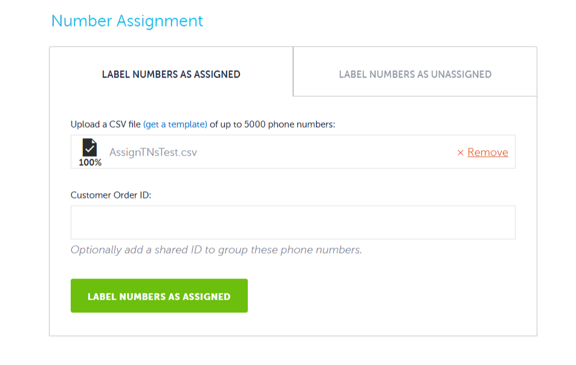

# Step By Step Guide To Number Assignment Using the Bandwidth Dashboard (Limited Availability)

### Bulk assigning up to 5000 TNs with an active end-user

You will notice your portal has a different look to it! In the upper right, you will see a widget with your number utilization percentage titled End-user number utilization.

To understand which numbers need to be assigned, hover your mouse over the “reports” tab in the middle of your dashboard. Choose “Reports Dashboard”.

There are a couple new reports here, but let’s first focus on the report that will give you a list of your Assigned, Pending Assignment, and Unassigned telephone numbers. Click on the END-USER PHONE NUMBER ASSIGNMENT report.

You can choose All statuses (default), Assigned, Pending Assignment, Unassigned.

Assigned TNs are TNs where Bandwidth can see traffic, or you have already marked them as assigned with an end-user in the portal, or in the last round of Number Utilization Review.

Pending Assignment TNs are TNs where Bandwidth cannot see traffic (these are the numbers you will want to pull).

Unassigned TNs are TNs that you have previously marked as unassigned and not with an end-user.

Note: You can choose multiple types of TNs to pull at once. Let’s just start with Pending Assignment.

Your report should begin processing in the upper right hand side of your screen, under Past reports.

Click on the CSV to download your report! The report name is initially blank and you can refresh your browser to populate the file name. You can open in Microsoft Excel directly but some manual steps may be required with other programs. Upon opening, you will receive a list of TNs. Please note: If your list is greater than 5k, you can use API documentation found [here](../apiReference.md) under /accounts /{accountId} /numbersAssignment.

Column B will read as “unknown” next to each TN.

* Column C will read as “expiry date.” This will only populate on assigned TNs. TN assignment will expire after 120 days. Note: If you are copying and pasting the TNs directly in the upload section, skip to Step 7. 
* You can delete both columns B & C. To do so, select B & C and right click, press delete.

* Change column A1 from TN to Number. It should look like this:

Please compare column A, your full TN list, against your inventory, and check to understand if any of these TNs are active with an end-user. Remove any TNs that are not active with an end-user.

Save this file as a CSV.

Once you have your list of TNs that are ready to be assigned, head back to the Dashboard. Hover over Numbers, and choose Number Assignment:

Verify the tab says “LABEL NUMBERS AS ASSIGNED” if this is the action you are choosing.

* You can either paste the list of numbers (phone numbers only, no header) in the box, or you can upload the CSV you have created with the Numbers header and TN list.
* If you choose to upload, once you click upload the screen will look like this:

* You can choose an optional customer order ID here. Click “label numbers as assigned”.
* Success! You have assigned your TNs. Please note that the numbers may not show up as assigned immediately, especially if you are assigning in bulk or using your API.

Once you have assigned all TNs active with end-users, the TNs will show up as assigned for 120 days, and your utilization widget on the front page will increase.
  
