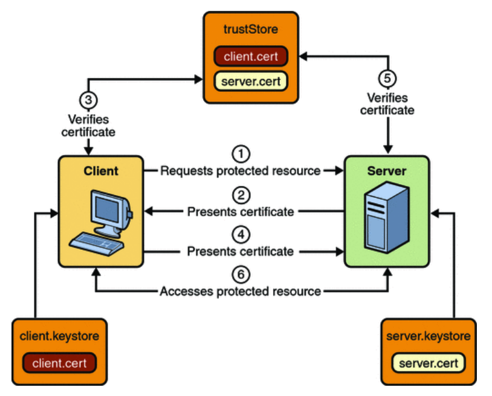

## Bandwidth Dashboard Subscriptions – Mutual Authentication

One of the options available for authentication of the callback API calls is to use a Mutual Authentication mechanism, where both parties validate the identity of the other party using the SSL certificate exchange mechanism.

The general mechanism for supporting this authentication mechanism is as follows, courtesy of the [Oracle Java EE 6 tutorial on security](https://docs.oracle.com/cd/E19226-01/820-7627/gijrp/index.html)

1. A client requests access to a protected resource.
2. The web server presents its certificate to the client.
3. The client verifies the server’s certificate.
4. If successful, the client sends its certificate to the server.
5. The server verifies the client’s credentials.
6. If successful, the server grants access to the protected resource requested by the client.

This is captured in the image below

This model will ensure that the communication is private, the parties are valid certificate holders, and that the parties are who they said they are, because their valid certificates match a previously declared public key.

From an implementation perspective the public key that you want us to verify against is passed in the `<PublicKey>` element of the /subscription. We will securely retain that public key, and validate that the public key matches the certificate presented in the initial response (2 above) from the server. This indicates that we have connected to the correct server. The next step in completing the bi-directional identity confirmation is for the Server to check the certificate presented in step 4, to ensure that the request is coming from Bandwidth. We can provide you with the public key that you should be checking, or you can retrieve it from the certificate presented as part of a standard exchange with our network edge (see below).

The <PublicKey> value presented in a <code class="post">POST</code> request new subscription should be a Base 64 encoding of the public key that is presented on requests to the Server that implements the callback handler. It can be saved as a Base 64 encoding of the certificate. To ensure compatibility we require that the file be Base 64 encoded again to ensure that the start and end characters, as well as any others which are not Base 64 encoded are included in the Base 64 blob that we store.

By way of example, if I wanted to set up a blob to store in the <PrivateKey> for my company “Joe’s Garage”, I could
do the following:

1. Obtain a certificate file, either from my records, or from my web server. One simple way to retrieve the certificate file from the web server is to inspect the certificate that is presented to a browser when browsing to the server. In Chrome for example a right-click on the address line lock icon, and selection of the “connection” tab will allow examination of the certificate. The certificate information dialog should allow downloading the certificate as a file. Save the file in Base 64 encoded format. This mechanism should also work for retrieving the Bandwidth Dashboard certificate for use in validating our identity in callbacks.
2. Base 64 encode the resulting file contents. Open the downloaded file in a text editor, and copy the contents (including the “---BEGIN CERTIFICATE---“ and “---END CERTIFICATE---“ into a Base 64 encoder (for example https://www.base64encode.org/ ) and encode the entire contents into Base 64 again. This eliminates strange characters. The resulting blob will have nothing but base 64 encoded data.
3. Take the text created in 2 above, and use it as the payload element data for the `<PrivateKey>` element.
 
 
